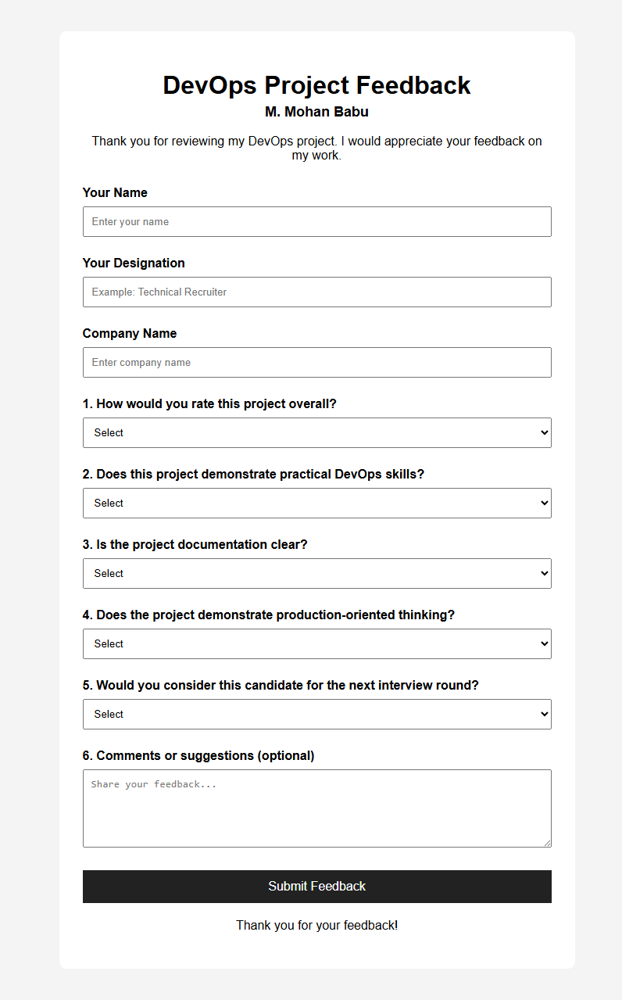
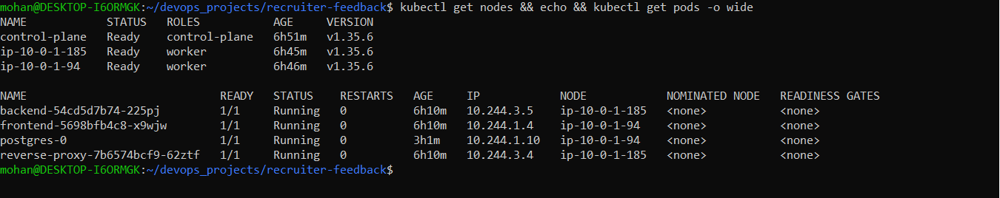
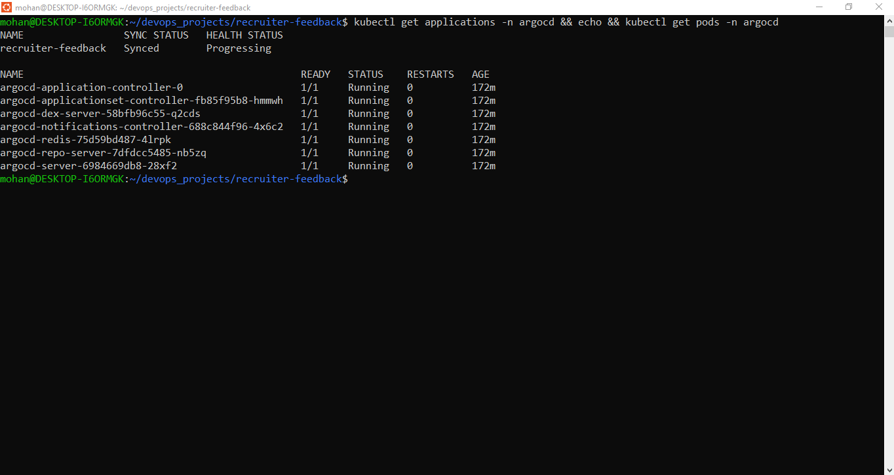
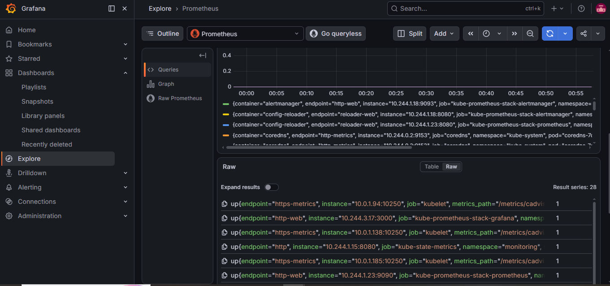
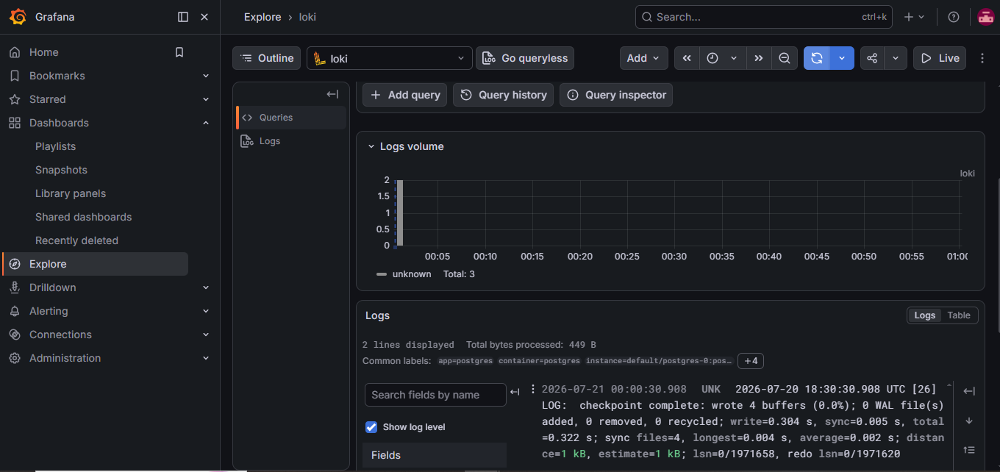

# Recruiter Feedback Dashboard

A production-oriented DevOps portfolio project demonstrating the complete lifecycle of deploying and operating a containerized three-tier web application using Docker, AWS, Kubernetes, Helm, Argo CD, Terraform, and a modern observability stack.

## Project Overview

The Recruiter Feedback Dashboard is a dynamic web application for collecting and viewing recruiter feedback.

### Application Stack

- **Frontend:** HTML, CSS, JavaScript, Nginx
- **Backend:** Python, Flask, Gunicorn
- **Database:** PostgreSQL
- **Reverse Proxy:** Nginx

The project demonstrates containerization, continuous integration, infrastructure provisioning, Kubernetes orchestration, Helm packaging, GitOps continuous delivery, ingress routing, monitoring, and centralized logging.

## Architecture

```text
                            USER
                              |
                              v
                   NGINX Ingress Controller
                              |
                              v
                       Reverse Proxy
                          (Nginx)
                         /       \
                        v         v
                  Frontend      Backend
                   Nginx     Flask/Gunicorn
                                  |
                                  v
                              PostgreSQL

     GitHub                                      Terraform
       |                                            |
       +---- GitHub Actions ---> Docker Hub         v
       |                                      AWS EC2 Instances
       |                                            |
       +---- Argo CD -------------------------------+
                              |
                              v
                    Kubernetes Cluster
                 1 Control Plane + 2 Workers

                    OBSERVABILITY
                 /                  \
                v                    v
       Prometheus + Grafana    Alloy + Loki
```

## Technology Stack

| Category | Technologies |
| --- | --- |
| Frontend | HTML, CSS, JavaScript, Nginx |
| Backend | Python, Flask, Gunicorn |
| Database | PostgreSQL |
| Containerization | Docker, Docker Compose |
| Container Registry | Docker Hub |
| Continuous Integration | GitHub Actions |
| Infrastructure as Code | Terraform |
| Cloud Infrastructure | AWS EC2 |
| Container Orchestration | Kubernetes, kubeadm, containerd |
| Kubernetes Packaging | Helm |
| Ingress | NGINX Ingress Controller |
| GitOps / CD | Argo CD |
| Metrics | Prometheus |
| Visualization | Grafana |
| Logging | Loki, Grafana Alloy |

## Application

The application was first containerized and validated locally using Docker Compose before being deployed to Kubernetes.



The application flow is:

```text
Browser -> NGINX Ingress -> Reverse Proxy -> Frontend / Backend -> PostgreSQL
```

## Docker and Local Integration

Each application component is containerized independently:

- Frontend container running Nginx
- Backend container running Flask with Gunicorn
- Reverse proxy container running Nginx
- PostgreSQL database container

Docker Compose was used to verify the complete application flow locally before moving to Kubernetes.

## Continuous Integration

GitHub Actions provides the CI pipeline for the project.

The pipeline builds the application container images and publishes them to Docker Hub.

```text
Source Code
    |
    v
GitHub Repository
    |
    v
GitHub Actions
    |
    +-- Build Backend Image
    +-- Build Frontend Image
    +-- Build Reverse Proxy Image
    |
    v
Docker Hub
```

## Infrastructure as Code

The AWS infrastructure is provisioned using Terraform.

The infrastructure hosts a self-managed Kubernetes cluster on EC2 with:

- 1 control plane node
- 2 worker nodes
- containerd as the container runtime
- kubeadm for cluster bootstrap

## Kubernetes

The application is deployed to the self-managed Kubernetes cluster using the following resources:

- Backend Deployment
- Frontend Deployment
- Reverse Proxy Deployment
- PostgreSQL StatefulSet
- Services
- ConfigMap
- Secret
- PersistentVolumeClaim
- StorageClass
- Ingress

### Cluster Verification



All three Kubernetes nodes reached the `Ready` state and the application workloads were successfully running.

## Helm

The application Kubernetes manifests are packaged as a Helm chart.

The project also uses Helm to manage infrastructure and observability components, including:

- Recruiter Feedback application
- NGINX Ingress Controller
- AWS EBS CSI Driver
- kube-prometheus-stack
- Loki
- Grafana Alloy

## Ingress

The NGINX Ingress Controller routes external traffic to the application.

Application hostname:

```text
recruiter-feedback.local
```

The application was successfully verified through the ingress controller NodePort.

## GitOps with Argo CD

Argo CD manages continuous delivery by reconciling the Helm chart stored in Git with the Kubernetes cluster.

```text
Git Push
   |
   v
GitHub Repository
   |
   v
Argo CD
   |
   v
Helm Chart
   |
   v
Kubernetes Cluster
```

### Argo CD Verification



The application is synchronized with the Git repository and the Argo CD components are running successfully.

> The application may appear as `Progressing` because the Ingress resource does not receive an external address in this bare EC2 NodePort-based setup. The application workloads themselves are healthy and the ingress route was verified successfully.

## Observability

The project includes metrics collection, visualization, and centralized Kubernetes logging.

### Prometheus

Prometheus is deployed through `kube-prometheus-stack` and collects Kubernetes cluster and component metrics.

The Prometheus `up` query successfully returned 28 monitored target series.



### Grafana

Grafana is used to explore metrics and logs through the Prometheus and Loki data sources.

### Loki and Grafana Alloy

Grafana Alloy collects Kubernetes logs and forwards them to Loki for centralized storage and querying.

Logs from the application namespace were successfully queried in Grafana Explore.



### Observability Flow

```text
Kubernetes Metrics
        |
        v
    Prometheus
        |
        v
     Grafana


Kubernetes Logs
        |
        v
  Grafana Alloy
        |
        v
       Loki
        |
        v
     Grafana
```

## Project Structure

```text
recruiter-feedback/
├── .github/
│   └── workflows/
├── argocd/
│   └── application.yaml
├── backend/
├── database/
├── docs/
│   └── images/
│       ├── application.png
│       ├── argocd.png
│       ├── kubernetes.png
│       ├── loki.png
│       └── prometheus.png
├── frontend/
├── helm/
│   └── recruiter-feedback/
├── monitoring/
│   ├── alloy/
│   │   └── values.yaml
│   ├── loki/
│   │   └── values.yaml
│   └── prometheus/
│       └── values.yaml
├── reverse-proxy/
├── terraform/
├── docker-compose.yml
└── README.md
```

## Local Deployment

Start the application locally with Docker Compose:

```bash
docker compose up -d
```

Verify the containers:

```bash
docker compose ps
```

Stop the environment:

```bash
docker compose down
```

## End-to-End DevOps Workflow

```text
Code
 |
 v
GitHub
 |
 +---------------------+
 |                     |
 v                     v
GitHub Actions       Argo CD
 |                     |
 v                     v
Docker Hub          Helm Chart
                       |
                       v
                Kubernetes Cluster
                       |
                       v
                Running Application
                       |
                 +-----+-----+
                 |           |
                 v           v
             Prometheus    Alloy
                 |           |
                 v           v
              Grafana      Loki
                             |
                             v
                          Grafana
```

## Key DevOps Skills Demonstrated

- Docker containerization
- Multi-container integration with Docker Compose
- Nginx reverse proxy configuration
- Git and GitHub version control
- CI automation with GitHub Actions
- Container image publishing to Docker Hub
- Infrastructure provisioning with Terraform
- AWS EC2 infrastructure
- Self-managed Kubernetes with kubeadm
- containerd container runtime
- Kubernetes persistent storage
- Helm chart packaging and deployment
- NGINX Ingress Controller
- GitOps continuous delivery with Argo CD
- Kubernetes monitoring with Prometheus
- Metrics visualization with Grafana
- Centralized logging with Loki and Grafana Alloy

## Author

**Mohan**
